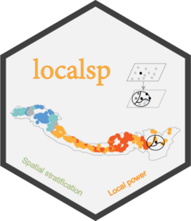

<!-- README.md is generated from README.Rmd. Please edit that file -->

```{r, include = FALSE}
knitr::opts_chunk$set(
  collapse = TRUE,
  comment = "##",
  fig.path = "man/figures/README-",
  out.width = "100%"
)
```

# localsp <a href="https://ausgis.github.io/localsp/"></a>

<!-- badges: start -->
[](https://CRAN.R-project.org/package=localsp)
[](https://CRAN.R-project.org/package=localsp)
[](https://CRAN.R-project.org/package=localsp)
[](https://ausgis.r-universe.dev/localsp)
[](https://doi.org/10.1080/13658816.2024.2437811)
[](https://github.com/ausgis/localsp/actions/workflows/R-CMD-check.yaml)
<!-- badges: end -->

**Local Indicator of Stratified Power**

## Installation

- Install from [CRAN](https://CRAN.R-project.org/package=localsp) with:

``` r
install.packages("localsp", dep = TRUE)
```

- Install development binary version from [R-universe](https://ausgis.r-universe.dev/localsp) with:

``` r
install.packages("localsp",
                 repos = c("https://ausgis.r-universe.dev",
                           "https://cloud.r-project.org"),
                 dep = TRUE)
```

- Install development source version from [GitHub](https://github.com/ausgis/localsp) with:

``` r
# install.packages("devtools")
devtools::install_github("ausgis/localsp",
                         build_vignettes = TRUE,
                         dep = TRUE)
```

## CITATION

Please cite **gdverse** as:

```
Lv, W., Lei, Y., Liu, F., Yan, J., Song, Y. and Zhao, W. (2025), gdverse: An R Package for Spatial Stratified Heterogeneity Family. Transactions in GIS, 29(2). https://doi.org/10.1111/tgis.70032

Hu, J., Song, Y., & Zhang, T. (2024). A local indicator of stratified power. International Journal of Geographical Information Science, 39(4), 925–943. https://doi.org/10.1080/13658816.2024.2437811
```

A BibTeX entry for LaTeX users is:

``` bib
@article{lyu2025gdverse, 
    title={{gdverse}: An {R} Package for Spatial Stratified Heterogeneity Family}, 
    volume={29}, 
    ISSN={1467-9671},
    number={2}, 
    journal={Transactions in GIS}, 
    publisher={Wiley}, 
    author={Lv, Wenbo and Lei, Yangyang and Liu, Fangmei and Yan, Jianwu and Song, Yongze and Zhao, Wufan},
    year={2025}, 
    month={mar}
}

@article{hu2024lisp, 
    title={A local indicator of stratified power}, 
    volume={39}, 
    ISSN={1362-3087},
    number={4}, 
    journal={International Journal of Geographical Information Science}, 
    publisher={Informa UK Limited},
    author={Hu, Jiao and Song, Yongze and Zhang, Tingbin},
    year={2024}, 
    month={dec}, 
    pages={925–943}
}
```
