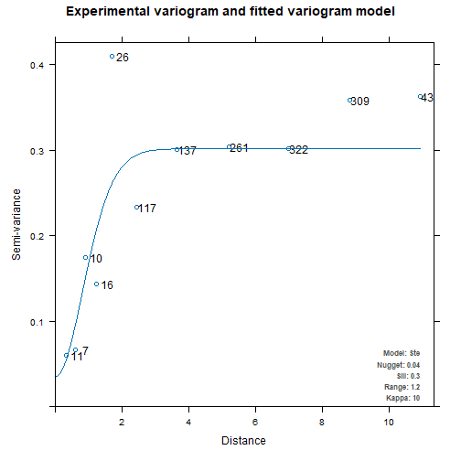

## Introduction to the **localsp** package

### 1.1 This package can be used to address following issues:

- Identify local power of individual determinants.

- Explore how spatial stratified association changes spatially and in local regions.

### 1.2 How to install this package:

- Install the stable version, please use:

```r
install.packages("localsp", dep = TRUE)
```

- Install the development version, please use:

```r
install.packages("localsp",
                 repos = c("https://ausgis.r-universe.dev",
                           "https://cloud.r-project.org"),
                 dep = TRUE)
```

1.3 General calculation process of LISP model:

Figure 1 shows the process of LISP, comprising three sequential steps. First, the optimal extent for local is identified using a spatial variogram to satisfy the criterion of a sufficiently small range and ensure that the data within the extent exhibit adequate heterogeneity and association. The second step is to analyze the PD of individual variables on the response variable through GD modeling with optimal spatial discretization algorithms and parameters at the local scale. The final step is to quantify the local PD of interaction variables, including the interaction of a pair of spatial variables and the interaction of multiple variables, using a tree-based spatial discretization approach and stratified heterogeneity approaches.

![**Figure 1**. The technical flowchart of the local indicator of stratified power (LISP) for examining the local power of determinants. ([Hu et al. 2024][1])](../man/figures/lisp/flowchart.jpg){width=500px}


### 1.4 Example data in this package:

The `gtc.csv` dataset documents glacier thickness changes (GTC) from 2000 to 2020, along with potential influencing factors in the Greater Himalayas, encompassing the Hengduan Mountains, Himalayas, Nyainqentanglha Mountains, Karakoram, and Hindu Kush (see Figure2). Variables such as *WinTem*, *SumTem*, and *Pre* represent the linear trends of winter temperature, summer temperature, and precipitation over the 2000–2020 period. *Elev*, *Aspect*, and *Slope* are derived from NASADEM data and correspond to elevation, aspect, and slope, respectively. *LakeArea* indicates the area of glacial lakes, while *SurAlbedo*, calculated from MODIS products, represents the surface albedo of glaciers.

![**Figure 2**. Spatial distribution of the thickness variations of lake-terminating glaciers in the Greater Himalayas. The dots in the chart represent the thickness variations of lake-terminating glaciers. The histogram in the figure shows the frequency of thickness changes at the terminus of glaciers connected to glacier lakes. ([Hu et al. 2024][1])](../man/figures/lisp/studyarea.jpg){width=500px}


``` r
gtc = readr::read_csv(system.file("extdata/gtc.csv", package = "localsp"))
## Rows: 908 Columns: 11
## ── Column specification ────────────────────────────────────────────────────────────────────────────────
## Delimiter: ","
## dbl (11): X, Y, GTC, Slope, Elev, LakeArea, WinTem, SumTem, Pre, Aspect, SurAlbedo
## 
## ℹ Use `spec()` to retrieve the full column specification for this data.
## ℹ Specify the column types or set `show_col_types = FALSE` to quiet this message.
gtc = sf::st_as_sf(gtc, coords = c("X","Y"), crs = 4326)
gtc
## Simple feature collection with 908 features and 9 fields
## Geometry type: POINT
## Dimension:     XY
## Bounding box:  xmin: 69.435 ymin: 27.4918 xmax: 102.75 ymax: 37.1104
## Geodetic CRS:  WGS 84
## # A tibble: 908 × 10
##       GTC  Slope  Elev LakeArea    WinTem  SumTem   Pre   Aspect SurAlbedo          geometry
##  *  <dbl>  <dbl> <dbl>    <dbl>     <dbl>   <dbl> <dbl>    <dbl>     <dbl>       <POINT [°]>
##  1 -0.766 0.0369  139.    4750.  0.00245   0.318  14.3  0.000233   0.0220  (75.7125 34.5219)
##  2 -0.948 0.124   137.    4559.  0.00131   0.281  12.6  0.000379   0.0123   (76.0715 34.343)
##  3 -2.05  0.411   154.    4428.  0.000229 -0.192   7.70 0.000429   0.0121  (90.2298 28.1097)
##  4 -0.525 0.0101  296.    4272.  0.00215   0.234  17.1  0.00130    0.0332  (72.7349 35.7435)
##  5 -0.950 0.0597  229.    5845.  0.000472  0.0204 28.7  0.00174    0.0262  (88.6606 27.9974)
##  6 -1.88  0.991   137.    5371.  0.000472 -0.0492 16.3  0.00174    0.0262   (88.687 27.9951)
##  7 -2.55  1.28    126.    5477.  0.000472 -0.294  14.5  0.00174    0.0262  (88.7123 27.9911)
##  8 -0.909 0.0444  217.    4691.  0.00155   0.326  17.3  0.00175    0.0359  (75.3851 35.3621)
##  9 -3.94  0.406   161.    3912. -0.000868  0.0490  7.88 0.00177    0.00379 (96.5057 29.4569)
## 10 -0.819 0.0122  153.    4066. -0.000529 -0.0356  6.40 0.00178    0.0415  (71.9206 36.3066)
## # ℹ 898 more rows
```


## Case study: identifying local stratified determinants of Mountain glacier thickness

### 2.1 Local extent exploration


``` r
v = automap::autofitVariogram(GTC ~ 1,gtc)
v
## $exp_var
##     np       dist      gamma dir.hor dir.ver   id
## 1   11  0.3389571 0.06079091       0       0 var1
## 2    7  0.6293936 0.06652231       0       0 var1
## 3   10  0.9278894 0.17501639       0       0 var1
## 4   16  1.2492295 0.14382694       0       0 var1
## 5   26  1.7004611 0.41004265       0       0 var1
## 6  117  2.4469826 0.23342367       0       0 var1
## 7  137  3.6686816 0.30107541       0       0 var1
## 8  261  5.2154522 0.30447724       0       0 var1
## 9  322  7.0108583 0.30203198       0       0 var1
## 10 309  8.8443752 0.35842465       0       0 var1
## 11 435 10.9281487 0.36289139       0       0 var1
## 
## $var_model
##   model      psill   range kappa
## 1   Nug 0.03547043 0.00000     0
## 2   Ste 0.26631800 1.24462    10
## 
## $sserr
## [1] 0.3693861
## 
## attr(,"class")
## [1] "autofitVariogram" "list"
plot(v)
```



### 2.2  Local power of determinants of individual variables


``` r
threshold = v$var_model$range[2] * 4
distmat = as.matrix(dist(sdsfun::sf_coordinates(gtc)))

lpd = localsp::lisp(GTC ~ ., data = gtc, threshold, distmat, cores = 12)
lpd
## # A tibble: 908 × 16
##    pd_Slope sig_Slope pd_Elev sig_Elev pd_LakeArea sig_LakeArea pd_WinTem sig_WinTem pd_SumTem
##       <dbl>     <dbl>   <dbl>    <dbl>       <dbl>        <dbl>     <dbl>      <dbl>     <dbl>
##  1    0.111  1.57e- 1  0.0721 0.00289        0.109     3.58e- 3    0.0808    0.329      0.138 
##  2    0.120  1.86e- 1  0.0716 0.00415        0.105     6.24e- 3    0.0833    0.281      0.137 
##  3    0.216  4.82e-10  0.0774 0.000290       0.346     5.49e-10    0.0474    0.0341     0.0232
##  4    0.141  2.40e- 2  0.132  0.000768       0.124     7.29e- 3    0.0291    0.540      0.175 
##  5    0.250  6.88e-10  0.0777 0.00192        0.226     4.14e- 5    0.0227    0.583      0.0179
##  6    0.249  7.64e-10  0.0776 0.00188        0.226     3.87e- 5    0.0228    0.580      0.0182
##  7    0.249  7.64e-10  0.0776 0.00188        0.226     3.87e- 5    0.0228    0.580      0.0182
##  8    0.121  2.02e- 1  0.0674 0.0183         0.114     4.25e- 3    0.0544    0.319      0.250 
##  9    0.288  2.16e- 3  0.0706 0.0301         0.368     2.95e-10    0.0971    0.00661    0.0723
## 10    0.179  2.45e- 2  0.121  0.0121         0.133     1.69e- 3    0.0297    0.799      0.235 
## # ℹ 898 more rows
## # ℹ 7 more variables: sig_SumTem <dbl>, pd_Pre <dbl>, sig_Pre <dbl>, pd_Aspect <dbl>, sig_Aspect <dbl>,
## #   pd_SurAlbedo <dbl>, sig_SurAlbedo <dbl>
```


## Reference

Hu, J., Song, Y., & Zhang, T. (2024). A local indicator of stratified power. International Journal of Geographical Information Science, 1–19. [https://doi.org/10.1080/13658816.2024.2437811][1].

&nbsp;

[1]: https://doi.org/10.1080/13658816.2024.2437811

&nbsp;
